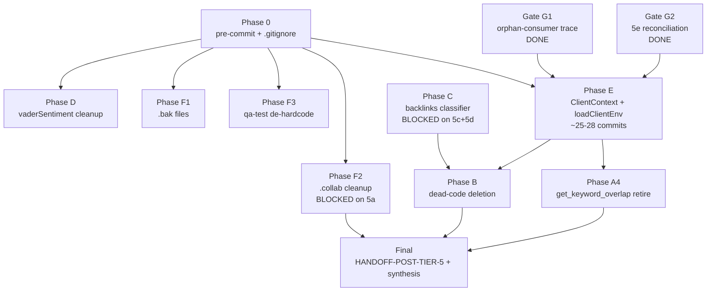

# Tier 5 Execution Plan — Final (v2, post-ultraplan reconciliation)

**Layered on top of:** `Claude Code Findings/HANDOFF-TIER-5-WIP.md` + `Claude Code Findings/TIER-5-PLAN.md`. Does not replace them — adds (a) cross-file scrub findings, (b) revised phase ordering, (c) gating discipline. **All line numbers and file existence claims in this version verified against `site-audit-fixes-tier-5` branch on 2026-05-04.**

## Context

Tier 5 is the architectural-cleanup tier. Per `tier-5-client-env-segregation-top-priority-global` bd memory and the user's explicit framing, the actual purpose is **client env/data segregation via a `ClientContext` wrapper (Python) + `loadClientEnv(slug)` helper (JS)**. Everything else (dead-code retirement, dual-path resolution, repo hygiene) is supporting cleanup.

User asked for a deeper cross-file scrub before execution because the prior 2026-04-29 audit was empirically wrong on most phases (caught at Phase A1 pre-flight). This plan reflects three full audit re-verifications (the original 2026-04-29 audit, the 2026-05-03 4-agent re-scrub, and a 2026-05-04 verification pass against ultraplan's refinement) and an architecture rule the user locked in.

**Note on remote refinement:** This plan was sent to `/ultraplan` for remote refinement. Ultraplan operated against a different working tree (`/home/user/site-audit/` branch `claude/refine-local-plan-m3aSc`), and several of its empirical claims contradicted our actual `site-audit-fixes-tier-5` state (e.g., it claimed `analyze-backlink-quality.js` doesn't exist — it exists at `template/scripts/` plus 7 client clones; it claimed vaderSentiment was absent from `pyproject.toml` — it's at line 23). The genuine improvements ultraplan produced were absorbed; the tree-mismatch artifacts were dropped. This is a recurring risk for remote refinement and worth flagging in any future ultraplan use.

## Architecture rule (user-locked)

**JS template/scripts own client-run data gathering. Python should not duplicate live API gather paths unless there is a specific platform-only reason.**

- JS owns DataForSEO gather scripts that write `seo/research/*.json`.
- Generator/normalizer consumes those research files.
- Python analyzers should produce only **derived analysis** that's actually consumed.
- Python producers that duplicate JS gather output get **soft-deprecated first**, then deleted after consumer-trace verification (no renderer/generator still consumes their shape).

Applies to all 5 dual-path findings + the 6 known DFS conflicts.

## Phase dependencies



Phases 0, D, F1, F3 can run in any order after Phase 0 lands. Phase E starts only after both gates clear (G1 and G2 are already complete this session). Phase B runs last because it's structured against the post-E ClientContext API surface.

## Phase ordering (user-locked)

### Phase 0 — Minimal pre-commit guardrails

Install `pre-commit` framework BEFORE any code commits so every Tier 5 commit is validated.

Steps:
1. `pip install pre-commit` (or add to `platform/pyproject.toml` dev deps)
2. Write `.pre-commit-config.yaml` at repo root with these hooks only:
   - `check-added-large-files` (default 500KB cap)
   - `trailing-whitespace`
   - `end-of-file-fixer`
   - Custom local hook: block any commit touching `clients/*/.env` (one-line bash hook)
   - (Optional, tune later) template/client sentinel guard
   - (Optional, tune later) hardcoded-client-name grep
3. `pre-commit install` — wire into `.git/hooks/pre-commit`
4. Update `.gitignore`: append explicit `clients/*/.env`, `*.js.bak`, `.collab/`. Root-level `.env` is already gitignored; `clients/*/.env` is defensive duplication.

Heavy lint / pytest / report-gen go to manual gates or CI later, not pre-commit. Reason: missing-deps and other instability still in flight; strict hooks block forward motion.

### Phase D — vaderSentiment cleanup (verified clean)

~3 commits:

- **D1:** Edit `platform/src/audit_platform/analyzers/local_seo.py`:
  - Delete the optional `try/except` import block at `:23-27`.
  - Delete `analyze_review_sentiment()` method body (`:96-182` per WIP handoff — re-verify exact lines on commit day).
  - Delete the call at `:67` and the `"reviewSentiment"` dict entry at `:77`.
  - Update module docstring to remove the VADER reference.

- **D2:** Remove `vaderSentiment>=3.3.2` from `platform/pyproject.toml:23`. **Verified present in our tree.** This is a real removal commit, not a no-op.

- **D3:** Test + docs cleanup:
  - `platform/tests/test_local_seo.py:83-129` — delete the **8** dedicated `test_sentiment_*` tests (verified count: positive_reviews, negative_reviews, mean_compound, reply_rate, total_reviews, keyword_extraction, empty_reviews, short_reviews_use_rating).
  - `platform/tests/test_local_seo.py:269` — delete `assert "reviewSentiment" in result` inside `test_full_analyze`.
  - `platform/tests/test_local_seo.py:277` — delete `assert result["reviewSentiment"]["summary"]["totalReviews"] == 0` inside `test_full_analyze_empty`.
  - `docs/SEO-AUDIT-SYSTEM.md:51` — drop "review sentiment" from the `LocalSeoAnalyzer` summary cell.
  - `docs/SEO-AUDIT-SYSTEM.md:155` — drop the `localSeo.reviewSentiment` row from the data-source table. **Verified present in our tree.**

Per-commit verification: `pytest platform/tests/ --tb=no -q` passes; `grep -rn "reviewSentiment\|vaderSentiment" platform/src platform/tests template docs` returns zero hits after D3 (excluding fixtures or generated `audit-data.json` snapshots, cleaned in a follow-up if discovered).

### Phase F — Repo hygiene (.bak + .collab + qa-test)

~3 commits:

- **F1:** `git rm` 4 verified tracked `.bak` files:
  - `template/reports/multipage/generate-multipage-report.js.bak`
  - `clients/laura-willis/reports/multipage/generate-multipage-report.js.bak`
  - `clients/liane-jamason/reports/multipage/generate-multipage-report.js.bak`
  - `clients/matt-wallmow/reports/multipage/generate-multipage-report.js.bak`

  `*.js.bak` is added to `.gitignore` in Phase 0. Closes bd `c6r`.

- **F2:** Per decision 5a — drop `.collab/collab.db` (sqlite, binary). User decision pending on the 9 `.md` prompt files. Add `.collab/` to `.gitignore` (already in Phase 0). Closes bd `8d2`. **Blocked on 5a.**

- **F3:** De-hardcode `template/reports/multipage/qa-test.js:129`:
  ```js
  return text.includes('Jamie Kelly') || text.includes('Mammoth Lakes') || text.includes('mammothlakesproperties');
  ```
  Replace with config-derived expected values (read `client-config.json` for `clientName`/`domain`) OR a generic "page rendered any content" assertion. Low risk.

### Verification gate — pre-Phase-E

Both already done this session:

- **G1: 15 suspect orphan consumers — DONE.** Trace complete. Result: **ZERO genuinely orphaned**. Classification:
  - 6 populate-produced (`advantages`, `competitorComparison`, `competitorStrategies`, `siteComparison`, `contentCalendar`, `blogPostsCreated`-related) via `template/scripts/populate-audit-data.js`.
  - 3 normalizer-derived (`keyStats`, `searchConsoleData`, `trafficData`) via `template/reports/multipage/generate-multipage-report.js`.
  - 6 agent-populated via `commands/seo-audit.md` Step 8a manual instructions (lines 1212-1219): `deliverables`, `keyPagesCreated`, `longTermColumns`, `mediumTermRoadmap`, `pillars`, `nextSteps`.

  No deletions added to Phase B from this list. The two verified orphan producers (`discoveredCompetitors` at `competitor.py:374-380`, `unlinkedMentions` at `build_audit.py:399-400`) remain Phase B deletion candidates after one final grep through generator/normalizer/search-index code, per user direction.

- **G2: 5e reconciliation — DONE.** `connectors/local_seo.py:214-324` (`check_local_pack` → `_check_local_pack_via_dataforseo` → `DataForSEOConnector.get_local_pack`) IS a real DFS dual-path with `template/scripts/gather-local-pack.js`. Phase B's original "analyzer has zero DFS" claim stands (different file: the analyzer at `analyzers/local_seo.py` indeed has no DFS calls). Reclassify finding as **connector-vs-JS**, not analyzer-vs-JS. Per architecture rule: JS wins, Python connector path soft-deprecated.

### Phase E — ClientContext + env-loading refactor (the main event)

~25-28 commits, organized in stages:

**Python side:**

- **E-Python-1:** Build `ClientContext` class (~40 LOC) in `platform/src/audit_platform/config/client_context.py`. Wraps existing pydantic `Settings` (currently at `platform/src/audit_platform/config/settings.py`). Uses `dotenv_values()` to read a per-client `.env` (`clients/<slug>/.env`) without polluting `os.environ`. Exposes the same field names as `Settings` plus `slug`, `client_root`, and `client_config` (parsed from `clients/<slug>/client-config.json`).

- **E-Python-2:** Refactor `connectors/base.py:37` `BaseConnector.__init__` to accept `ctx: ClientContext | None = None` and fall back to constructing one from a default `Settings()` for tests. **Line verified: `:37`** (prior plan said `:42`; ultraplan said `:28-33`; both were wrong). Update all subclasses' constructors that currently take `settings` (`brand_mentions.py`, `business_profile.py`, `crux.py`, `dataforseo.py`, `ga4.py`, `google_ads.py`, `local_seo.py`, `pagespeed.py`, `search_console.py`, `social_audit.py`).

- **E-Python-3:** Refactor `platform/scripts/build_audit.py` `main()` orchestrator:
  - Add `--client-slug` arg (existing `--client-config` arg becomes the foothold — derive default slug from its parent dir).
  - Replace `settings = Settings()` with `ctx = ClientContext.from_slug(args.client_slug)`.
  - Thread `ctx` through to `AuditOrchestrator.__init__`.
  - Update internal references like `self.args.domain` to prefer `ctx.client_config["domain"]` when the flag isn't passed.

- **E-Python-4:** Fix `analyzers/reporting_intelligence.py:572` `os.environ.get("ANTHROPIC_API_KEY")` bypass — accept a `ClientContext` (or settings) in the analyzer and read the key from there.

- **E-Python-5..N:** Refactor 13 test scripts in `platform/scripts/` (`test_brand_mentions.py`, `test_business_profile.py`, `test_crux.py`, `test_dataforseo.py`, `test_ga4.py`, `test_google_ads.py`, `test_local_seo.py`, `test_pagespeed.py`, `test_search_console.py`, plus `run_all.py`, `run_backlink_analysis.py`, `run_rank_tracker.py`, `generate_oauth_token.py`) to take `--client-slug` and construct `ClientContext`.

- **E-Smoke-Python:** matt-wallmow smoke test — one credentialed gather (DFS-backed) + one analyzer + sanity check that the Python pipeline still produces an audit. Halt and triage if anything regresses. Commit the smoke-test log/assertion script under `platform/scripts/smoke/`.

**JS side:**

- **E-JS-1:** Build `lib/load-client-env.js` (new file, root-level `lib/` does not yet exist). Two strategies; recommend **Strategy A**:
  - **Strategy A (recommended):** Add `dotenv` to root `package.json` dependencies (current deps: `pptxgenjs`, `xlsx`). `loadClientEnv(slug)` reads `clients/<slug>/.env` via `dotenv.parse()` and returns an object — does NOT mutate `process.env`. Each gather script destructures the returned object instead of reading globals.
  - **Strategy B:** Use Node 20+ `--env-file=clients/<slug>/.env` flag; helper just resolves the path. Fewer deps but ties scripts to invocation form.

- **E-JS-2..7:** Replace `process.env.X` with `loadClientEnv(slug).X` in 6 template gather scripts:
  - `template/scripts/gather-keyword-volumes.js`
  - `template/scripts/gather-domain-metrics.js`
  - `template/scripts/gather-pagespeed.js`
  - `template/scripts/gather-organic-metrics.js`
  - `template/scripts/gather-backlinks.js`
  - `template/scripts/gather-local-pack.js`

- **E-JS-update-orchestrator:** Update `commands/seo-audit.md` to thread slug explicitly. Today's flow uses `cd clients/<slug>` so `process.env` magically picks up that client's `.env` from cwd — that's the unsafe path being closed.

- **E-Smoke-JS:** matt-wallmow smoke test — one JS gather invocation against new helper, confirm it reads from the right `.env`.

- **E-Smoke-Render:** Generate the multipage report against matt-wallmow, open and visually confirm key sections (CWV, links, backlinks, competitors, local) populate. Confirm no client-specific data leaked into `template/`.

- **E-Cohort-Propagate:** Run Step 1.5 once across the cohort (8 client dirs at `clients/{calgary-castles,chris-nevada,laura-willis,liane-jamason,mammoth-lakes,matt-wallmow,murray-gardner,p3realtync}/scripts/`). Single commit (or one per client, decide at the time). Inspect any backups/orphan warnings. Calgary's known fork stays an exception.

Smoke tests are commit-able artifacts — not throwaway runs.

### Phase C — Backlinks classifier cleanup (per decisions 5c + 5d)

~6-9 commits + cohort propagation. **Files verified to exist in our tree:**

- `template/scripts/analyze-backlink-quality.js` — JS classifier (verified present, plus 7 client clones at `clients/{calgary-castles,chris-nevada,laura-willis,liane-jamason,mammoth-lakes,murray-gardner,p3realtync}/scripts/`)
- `platform/src/audit_platform/analyzers/backlinks.py:122` — Python classifier (per WIP handoff)
- `template/reports/multipage/generate-multipage-report.js:2275-2380` — renderer-side third heuristic classifier (file is currently 3173 lines; specific line range will need re-verification on commit day, but neighborhood is correct per WIP audit)
- `template/reports/multipage/pages/backlink-opportunities.js:349-454` — heuristic UI section to potentially strip

Specific shape depends on user answers to 5c (kill all classifiers vs partial) and 5d (strip backlinks page to raw `referring_domains[]` vs keep heuristic UI section). **Open — surfacing again below.**

### Phase B — Dead-code deletion (re-scoped)

After E exists, B deletes dead Python code against the new ClientContext API surface. ~6-10 commits including:

- New from this scrub: delete `competitorAnalysis.discoveredCompetitors` write (`platform/src/audit_platform/analyzers/competitor.py:374-380`). Re-grep for consumers of `discoveredCompetitors` before deletion.
- New from this scrub: delete `contentGap.unlinkedMentions` write (`platform/scripts/build_audit.py:399-400`).
- WIP handoff §6 Phase B items: `competitor.py` dead-code paths; `content_gap.py` entirely; `local_seo.py` analyzer dead-code paths; `connectors/local_seo.py:214-324` `check_local_pack` Python path soft-deprecate per architecture rule.
- Decision 5b — `rank_tracker.py` orphan: build out (defer) OR delete. **Renderer consumer code verified at `:1040-1094` (rankHistory transposition) AND `:2588-2642` (the "11. rankHistory — reformat rank-history.json" auto-populate block; ends at `:2642` with `'Auto-populated rankHistory'` log).** Both ranges are real consumer code; if 5b=delete, both blocks come out. **Open on 5b.**

### Phase A4 — Standalone retirement

Single commit, independent of all others: retire `get_keyword_overlap` from `platform/src/audit_platform/connectors/dataforseo.py` (zero callers, verified). Schedule near end as a low-stakes capstone.

### Final

`HANDOFF-POST-TIER-5.md` + `FINAL-SYNTHESIS` Tier 5 SHIPPED appendix.

**Total estimated: 45-55 commits.**

## Open user decisions (still blocking specific phases)

| # | Decision | Blocks |
|---|---|---|
| 5a | `.collab/.md` files — keep in `/root/site-audit-retired/.collab/` or drop entirely | Phase F2 |
| 5b | `rank_tracker.py` orphan — build out (defer) or delete + remove renderer-side code at `:1040-1094` and `:2588-2642` | Phase B |
| 5c | Phase C dual classifier — kill all (JS + Python + renderer heuristic) per strict D1, or kill only one | Phase C |
| 5d | Phase C page redesign — strip backlinks page to raw `referring_domains[]` table, or keep heuristic health-analysis section (~100 LOC of UI) | Phase C |

Phase 0, D, F1, F3, the verification gate, and Phase E can all proceed without these answers. C, B, and F2 are blocked.

## Critical files

- `CLAUDE.md` — fix-work hard rules + TANDEM override
- `Claude Code Findings/HANDOFF-TIER-5-WIP.md` — prior context
- `Claude Code Findings/TIER-5-PLAN.md` — prior plan with §2.5 audit re-verification
- `.gitignore` — append `clients/*/.env`, `*.js.bak`, `.collab/` (Phase 0)
- `.pre-commit-config.yaml` — new file in Phase 0
- `platform/pyproject.toml:23` — Phase D2 vaderSentiment removal (verified present)
- `platform/src/audit_platform/config/settings.py` — current pydantic Settings (Phase E baseline)
- `platform/src/audit_platform/config/client_context.py` — new file in Phase E
- `platform/src/audit_platform/connectors/base.py:37` — Phase E refactor point (verified)
- `platform/src/audit_platform/connectors/local_seo.py:214-324` — DFS dual-path soft-deprecate
- `platform/src/audit_platform/analyzers/local_seo.py` — Phase D vaderSentiment cleanup (lines per WIP)
- `platform/src/audit_platform/analyzers/reporting_intelligence.py:572` — Phase E env-bypass fix
- `platform/src/audit_platform/analyzers/competitor.py:374-380` — Phase B orphan-producer delete
- `platform/src/audit_platform/analyzers/rank_tracker.py` — Phase B orphan candidate (5b)
- `platform/scripts/build_audit.py:399-400` — Phase B orphan-producer delete; `main()` — Phase E entry refactor
- `platform/tests/test_local_seo.py:83-129,269,277` — Phase D test cleanup
- `template/scripts/populate-audit-data.js` — G1 verification target (already complete)
- `template/scripts/gather-{keyword-volumes,domain-metrics,pagespeed,organic-metrics,backlinks,local-pack}.js` — Phase E JS refactor (6 scripts)
- `template/scripts/analyze-backlink-quality.js` — Phase C classifier (verified present, 8 locations including clones)
- `template/reports/multipage/generate-multipage-report.js` — 3173 lines; Phase C renderer-side classifier near `:2275-2380` (re-verify on commit day); Phase B rank_tracker auto-populate at `:1040-1094` and `:2588-2642`
- `template/reports/multipage/pages/backlink-opportunities.js:349-454` — Phase C UI strip (pending 5d)
- `template/reports/multipage/qa-test.js:129` — Phase F3 hardcoded-test cleanup
- `commands/seo-audit.md` — Phase E orchestrator update; Step 8a populate references at `:1212-1219`
- `lib/load-client-env.js` — new file in Phase E (root-level `lib/` does not yet exist)
- `package.json` — Phase E if Strategy A: add `dotenv` dep (current deps: `pptxgenjs`, `xlsx`)
- `docs/SEO-AUDIT-SYSTEM.md:51,155` — Phase D doc cleanup (both locations verified)

## Verification

**Per-commit (every commit, all phases):**
- `pytest platform/tests/ --tb=no -q` passes
- Pre-commit hooks pass (Phase 0 onward)
- One fix per commit; staged explicitly by path; commit footer `Co-Authored-By: Claude Opus 4.7 (1M context) <noreply@anthropic.com>`

**Phase D-specific:**
- `grep -rn "reviewSentiment\|vaderSentiment" platform/src platform/tests template docs` returns zero hits after D3 (allow exceptions inside generated `audit-data.json` snapshots).

**Phase F-specific:**
- `find . -name "*.js.bak" -not -path "./node_modules/*"` returns zero hits after F1.
- `git ls-files | grep .collab/` returns zero hits after F2.
- `node template/reports/multipage/qa-test.js` runs against generated test output for matt-wallmow without hardcoded-string assertion failures.

**Phase E gates (smoke tests):**
- E-Smoke-Python: matt-wallmow audit runs end-to-end via `python platform/scripts/build_audit.py --client-slug matt-wallmow`; no `os.environ` reads outside `ClientContext`; report data fields populate as before.
- E-Smoke-JS: one gather (e.g., `gather-domain-metrics.js`) invoked with new `loadClientEnv(slug)` helper, reads correct `.env`, writes correct `seo/research/*.json`.
- E-Smoke-Render: `node template/reports/multipage/generate-multipage-report.js --data clients/matt-wallmow/seo/audit-data.json --inline` produces a report whose Index / Keywords / Content / Technical / Links / Competitors / Local / Action-Plan pages all pass `HANDOFF.md` lines 80-91 verification checklist.
- E-Cohort-Propagate: after Step 1.5 propagation, `git diff template/scripts clients/*/scripts -- ':!clients/calgary*'` shows no drift outside the documented Calgary exception.

**Final pre-push verification:**
- `gh auth setup-git` (HTTPS remote needs gh credential helper)
- User explicitly approves push (TANDEM rule §3 — never push without explicit user direction)

## Hard rules (carried forward)

1. One fix per commit; cohort commits only for mechanical Step-1.5 propagation
2. Don't modify finding text — append under `## Additional Information`
3. Stage explicitly by path — never `git add .`
4. Don't push without explicit user direction (TANDEM §3)
5. Commit footer: `Co-Authored-By: Claude Opus 4.7 (1M context) <noreply@anthropic.com>`
6. matt-wallmow is the reference client for all functional verification
7. `gh auth setup-git` before any `git push`
8. **Trust empirical re-verification, not prior audit framings.** This plan has now survived three audit re-verification passes (2026-04-29 audit, 2026-05-03 4-agent re-scrub, 2026-05-04 ultraplan-reconcile). Each surfaced material errors in prior framings. The pattern: a claim about a file's contents/lines/existence that "sounds plausible" can still be wrong. Always grep before deleting; always read before refactoring; never trust line numbers older than the working tree's last commit.

## Reconciliation log (v2 changes)

What changed when ultraplan's refinement was reconciled against our actual tree:

**Genuine improvements absorbed from ultraplan:**
- D3 expanded to also clean `docs/SEO-AUDIT-SYSTEM.md:155` (verified present)
- D3 test count corrected: 8 sentiment tests + 2 assertions inside `test_full_analyze` at `:269` and `:277` (verified)
- F1 explicit `.bak` path list (4 files, verified exact)
- Phase 0 explicit `pip install pre-commit && pre-commit install` step
- Phase E JS Strategy A vs B explicit framing with `package.json` dep note
- Mermaid phase-dependency diagram

**Ultraplan claims dropped (wrong against our tree):**
- D2 → no-op claim — vaderSentiment IS at `pyproject.toml:23` in our tree
- BaseConnector at `:28-33` — actual line is `:37`; both prior framings (`:42` from WIP, `:28-33` from ultraplan) were wrong
- `analyze-backlink-quality.js` absence claim — file exists at `template/scripts/` plus 7 client clones; Phase C scope intact
- `generate-multipage-report.js` 2724-line claim — actual is 3173 lines
- rank_tracker `:2589-2642` "unrelated" claim — that range is the rank_tracker auto-populate block ("11. rankHistory — reformat rank-history.json"), real consumer code

**Likely cause of discrepancies:** Ultraplan was working against a different tree (`/home/user/site-audit/` branch `claude/refine-local-plan-m3aSc`) — its empirical state had drifted from our `site-audit-fixes-tier-5`. Future ultraplan invocations should be re-pushed against the latest committed plan in our actual branch to minimize this.
